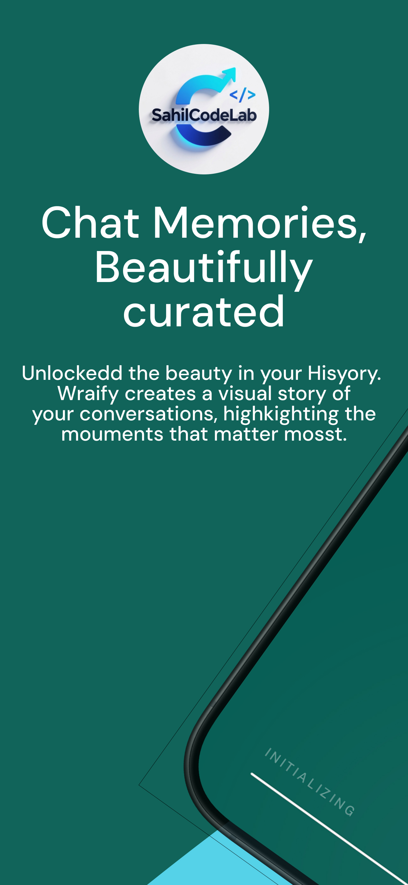

# Wrapify

## Rediscover Your WhatsApp Memories, Refined.

Wrapify is a luxurious, private-first WhatsApp chat analytics engine by SahilCodeLab. It transforms your raw chat history into stunning, visual narratives and 3D insights—all while maintaining absolute data sovereignty.

### Key Features
- **3D Interactive Insights**: Experience your data in a multi-dimensional dashboard.
- **Neural Privacy**: 100% offline analysis. No servers. No tracking.
- **Stunning Visuals**: Generate high-resolution 'Wrapped' cards and charts.
- **Clean Aesthetic**: A premium midnight tech-dark theme designed for the elite digital citizen.

### How to Use
1. **Export Protocol**: Go to WhatsApp -> More -> Export Chat (Without Media).
2. **Local Import**: Select the `.txt` file in Wrapify.
3. **Reveal Excellence**: Enjoy your personalized analytics.

### Privacy Promise
Wrapify performs all analysis locally on your smartphone. We do not use cloud-based parsing or external processing APIs. Your digital memories stay under your control.

### Developed by SahilCodeLab
Handcrafted with ❤️ in India by **Sahil**, focused on privacy-first innovation.

---
&copy; 2026 SahilCodeLab. Distributed by India Labs.
